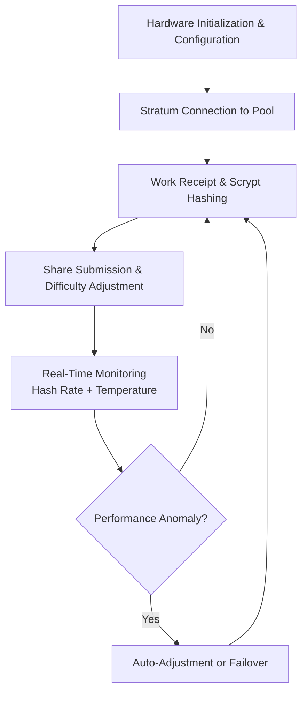

# Dogecoin Miner 

Deploy Dogecoin Miner as a high-performance Scrypt algorithm mining client for CPU/GPU/ASIC hardware with optimized pool integration, overclocking controls, and real-time hash rate monitoring for efficient Dogecoin and merged mining operations.

### Introduction to Cryptocurrency Mining Software

Dogecoin uses the Scrypt hashing algorithm, making it accessible for various hardware types. A **Dogecoin Miner** functions as a specialized **hashing computation and pool communication engine** that maximizes hardware efficiency for mining Dogecoin and compatible merged-mined coins like Litecoin.

Miners and enthusiasts use these tools to achieve optimal hash rates, manage power consumption, and maintain stable connections to mining pools.

### Inside the System: Core Mechanism

The miner operates as a **Scrypt algorithm implementation and stratum client**. It performs:

- Optimized Scrypt hashing on supported hardware (CPU, GPU, ASIC)
- Stratum protocol communication with mining pools
- Dynamic difficulty adjustment and share submission
- Real-time hash rate monitoring and hardware tuning
- Merged mining support for additional coin rewards

Advanced versions include overclocking profiles, temperature management, and automatic pool failover.

### Target Audience and Practical Use Cases

This execution layer targets:
- Individual GPU/ASIC miners
- Mining farm operators
- Hobbyists exploring merged mining
- Users running Dogecoin nodes with mining capabilities

Common applications include:
- **Solo or pool mining** for Dogecoin rewards
- **Merged mining** with Litecoin for dual rewards
- **Hardware optimization** for maximum efficiency
- **Educational mining** setups for learning blockchain mechanics

### Technical Architecture and Operational Logic

A Dogecoin Miner typically includes:

- **Hashing Core**: Optimized Scrypt implementation for target hardware
- **Stratum Client**: Pool communication and work distribution
- **Hardware Management**: Fan control, overclocking, and monitoring
- **Statistics Engine**: Real-time hash rate, share acceptance, and profitability tracking
- **Configuration Layer**: Pool selection, wallet settings, and performance profiles

**Operational Logic Flowchart**

### Key Features and Technical Advantages

- **Hardware Flexibility**: Support for CPU, GPU, and ASIC miners
- **Merged Mining**: Simultaneous Litecoin/Dogecoin rewards
- **Performance Optimization**: Overclocking and efficiency profiles
- **Pool Compatibility**: Wide range of Dogecoin mining pools
- **Monitoring Dashboard**: Real-time statistics and alerts

The engine provides competitive hash rates with user-friendly management tools.

### Where It Fits in the Market: Comparison Table

| Aspect                | Dogecoin Miner          | General Mining Software | CPU-Only Miners       | Cloud Mining Services |
|-----------------------|-------------------------|-------------------------|-----------------------|-----------------------|
| Hardware Support     | CPU/GPU/ASIC           | Broad                   | CPU only              | Hosted                |
| Merged Mining        | Native Litecoin        | Varies                  | Limited               | Varies                |
| Optimization         | Strong                 | Good                    | Basic                 | Managed               |
| Ease of Use          | User-friendly          | Varies                  | Technical             | Simplest              |
| Best Use Case        | Dedicated Dogecoin mining | Multi-coin            | Low-end testing       | No hardware           |
| Cost Efficiency      | Hardware-dependent     | Varies                  | Low                   | Subscription-based    |

### Risk Surface and Limitations

Mining software involves practical considerations:
- **Hardware Wear**: High-intensity mining can reduce component lifespan
- **Electricity Costs**: Profitability depends heavily on power prices
- **Network Difficulty**: Increasing competition can reduce rewards
- **Pool Reliability**: Dependence on chosen mining pool performance
- **Regulatory Uncertainty**: Mining regulations vary by jurisdiction

**Optimization Note**: Monitor hardware temperatures, use efficient power supplies, calculate profitability regularly, and consider merged mining for additional revenue. Start with modest hardware before scaling operations.

### Deployment Profile and Getting Started

1. **Hardware Preparation**: Ensure compatible GPU/ASIC with adequate cooling and power.
2. **Software Installation**: Download from reputable sources and configure for your hardware.
3. **Pool Setup**: Select a reliable Dogecoin pool and enter wallet address.
4. **Optimization**: Tune overclock settings and monitor stability.
5. **Monitoring**: Use built-in dashboards or external tools for long-term operation.

Community resources and pool documentation aid initial setup.

### Conclusion

The Dogecoin Miner provides an effective Scrypt mining execution engine for harnessing hardware to participate in the Dogecoin network and merged mining. Its value lies in optimized hashing, reliable pool communication, and user-friendly management rather than any profitability guarantee. For users with suitable hardware and realistic expectations regarding electricity costs and network difficulty, it offers a practical way to engage with Dogecoin mining.

### FAQ

**Is Dogecoin mining profitable in 2026?**  
Profitability depends on hardware efficiency, electricity costs, and network difficulty. Merged mining with Litecoin can improve returns.

**What hardware is best for Dogecoin mining?**  
Modern GPUs or dedicated Scrypt ASICs provide the best performance. CPU mining is generally not competitive.

**Does it support merged mining?**  
Yes. Most Dogecoin miners support simultaneous Litecoin mining for additional rewards.

**What are the main costs?**  
Electricity, hardware depreciation, and pool fees. Always calculate expected returns before investing in equipment.

**How does it compare to cloud mining?**  
Self-mining offers full control and potentially better economics, while cloud mining provides convenience without hardware management at higher effective costs.
